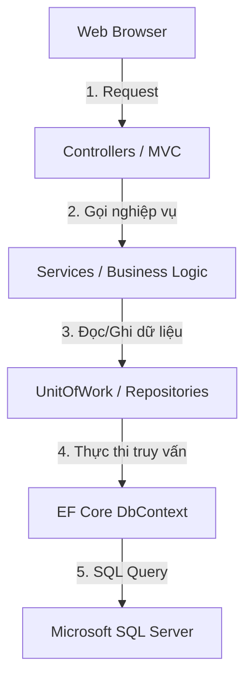

# TÀI LIỆU THIẾT KẾ KIẾN TRÚC HỆ THỐNG DOCCONNECT (MONOLITHIC + REPOSITORY PATTERN)
> **Hệ thống tư vấn sức khỏe trực tuyến (Online Health Consulting System)**
> **Mã nguồn:** C# / .NET 10.0 (ASP.NET Core MVC)
> **Cơ sở dữ liệu:** Microsoft SQL Server (EF Core)
> **Mẫu thiết kế:** Repository Pattern & Unit of Work

Tài liệu này trình bày thiết kế kiến trúc monolithic, cấu trúc thư mục áp dụng mẫu thiết kế **Repository Pattern & Unit of Work**, luồng dữ liệu thông qua cơ chế **Dependency Injection (DI)** và giải pháp kết nối trực tiếp với **SQL Server** trong hệ thống **DocConnect**.

---

## 1. Lựa Chọn Kiến Trúc & Mẫu Thiết Kế (Design Patterns)

### 1.1. Kiến trúc Monolithic (Đơn khối)
Toàn bộ giao diện, nghiệp vụ và xử lý dữ liệu được đóng gói trong dự án `DocConnect.Web` giúp đơn giản hóa việc quản lý mã nguồn, triển khai nhanh và kiểm thử thuận tiện.

### 1.2. Mẫu thiết kế Repository Pattern & Unit of Work
Để tránh việc các Controller hoặc Service truy vấn trực tiếp vào `DbContext` (gây khó khăn cho kiểm thử đơn vị và dễ lặp lại code), dự án áp dụng mẫu thiết kế Repository nhằm trừu tượng hóa tầng truy xuất dữ liệu:
* **Generic Repository (`IGenericRepository<T>`):** Định nghĩa các thao tác CRUD cơ bản dùng chung cho tất cả các bảng dữ liệu (như `GetById`, `GetAll`, `Add`, `Update`, `Delete`).
* **Specific Repositories (như `IUserRepository`, `IAppointmentRepository`):** Kế thừa từ Generic Repository và bổ sung các phương thức truy vấn đặc thù (ví dụ: tìm bác sĩ theo chuyên khoa, kiểm tra lịch hẹn trùng ca khám).
* **Unit of Work (`IUnitOfWork`):** Đóng vai trò là một điểm quản lý duy nhất để lưu các thay đổi (`SaveChanges`) vào CSDL. Điều này đảm bảo tính toàn vẹn dữ liệu (Transaction) khi có nhiều thay đổi trên nhiều bảng trong cùng một luồng nghiệp vụ.

---

## 2. Cấu Trúc Thư Mực Dự Án (Project Folder Structure)

Cấu trúc thư mục được cập nhật tích hợp tầng Repository và Unit of Work:

```text
DocConnect/
├── DocConnect.sln                      # Solution quản lý dự án
├── docs/                               # Tài liệu thiết kế hệ thống
│   ├── ARCHITECTURE.md                 # Tài liệu này
│   └── SPEC.md                         # Đặc tả nghiệp vụ
├── skills/                             # Hướng dẫn lập trình và quy chuẩn
│
└── DocConnect.Web/                     # Dự án Monolithic chính (ASP.NET Core Web App)
    ├── Program.cs                      # Đăng ký DI, cấu hình DB Connection, Middleware & Routing
    ├── appsettings.json                # Chứa chuỗi kết nối SQL Server (ConnectionString)
    │
    ├── Data/                           # Tầng Dữ liệu & Lưu trữ (Data Access Layer)
    │   ├── ApplicationDbContext.cs     # Lớp DbContext kế thừa từ IdentityDbContext / DbContext
    │   ├── Entities/                   # Định nghĩa các thực thể CSDL (User, Patient, Doctor...)
    │   ├── Migrations/                 # Quản lý nâng cấp lược đồ SQL Server
    │   │
    │   ├── Repositories/               # Tầng Repository
    │   │   ├── Interfaces/             # Định nghĩa Interface
    │   │   │   ├── IGenericRepository.cs
    │   │   │   ├── IUserRepository.cs
    │   │   │   ├── IDoctorRepository.cs
    │   │   │   └── IAppointmentRepository.cs
    │   │   └── Implementations/        # Triển khai cụ thể các Interface
    │   │       ├── GenericRepository.cs
    │   │       ├── UserRepository.cs
    │   │       ├── DoctorRepository.cs
    │   │       └── AppointmentRepository.cs
    │   │
    │   └── UnitOfWork/                 # Quản lý Transaction & SaveChanges
    │       ├── IUnitOfWork.cs
    │       └── UnitOfWork.cs
    │
    ├── Services/                       # Tầng Nghiệp vụ (Business Logic Layer)
    │   ├── Interfaces/                 # Định nghĩa Interface (IAppointmentService, IChatService...)
    │   ├── AppointmentService.cs       # Gọi UnitOfWork/Repository để xử lý lịch hẹn
    │   └── EncryptionService.cs        # Mã hóa thông tin bệnh án nhạy cảm (AES-256)
    │
    ├── Controllers/                    # Tầng Điều hướng (MVC Controllers)
    │   ├── HomeController.cs
    │   ├── AccountController.cs
    │   ├── AppointmentController.cs    # Chỉ nhận DI từ tầng Services (hoặc UnitOfWork)
    │   └── ConsultationController.cs   # Điều hướng phòng khám và xử lý API Chat AJAX
    │
    ├── Models/                         # ViewModels & DTOs
    ├── Views/                          # Razor MVC Views
    └── wwwroot/                        # Tệp tĩnh (CSS, JS, Images, Libs)
```

---

## 3. Luồng Dữ Liệu & Cơ Chế Dependency Injection (DI)

### 3.1. Sơ đồ tương tác luồng dữ liệu (Data & Control Flow)
Dữ liệu di chuyển tuần tự qua các lớp trung gian để đảm bảo tính độc lập và khả năng kiểm thử cao.



### 3.2. Cấu hình Dependency Injection (DI) trong `Program.cs`
ASP.NET Core sử dụng cơ chế Built-in IoC Container để quản lý vòng đời của các Service. Tất cả các thành phần y khoa sẽ được đăng ký trong `Program.cs` thông qua phương thức `AddScoped` (vòng đời tồn tại theo từng HTTP Request).

Ví dụ đoạn mã cấu hình DI tiêu biểu:
```csharp
// 1. Cấu hình SQL Server Connection
builder.Services.AddDbContext<ApplicationDbContext>(options =>
    options.UseSqlServer(builder.Configuration.GetConnectionString("DefaultConnection")));

// 2. Đăng ký Generic Repository và Unit of Work
builder.Services.AddScoped<IUnitOfWork, UnitOfWork>();
builder.Services.AddScoped(typeof(IGenericRepository<>), typeof(GenericRepository<>));

// 3. Đăng ký các Specific Repositories
builder.Services.AddScoped<IUserRepository, UserRepository>();
builder.Services.AddScoped<IDoctorRepository, DoctorRepository>();
builder.Services.AddScoped<IAppointmentRepository, AppointmentRepository>();

// 4. Đăng ký tầng Business Logic Services
builder.Services.AddScoped<IAppointmentService, AppointmentService>();
builder.Services.AddScoped<IEncryptionService, EncryptionService>();
```

---

## 4. Đặc Điểm Triển Khai các Lớp

### 4.1. Interface Generic Repository tiêu biểu
```csharp
public interface IGenericRepository<T> where T : class
{
    Task<T?> GetByIdAsync(Guid id);
    Task<IEnumerable<T>> GetAllAsync();
    Task AddAsync(T entity);
    void Update(T entity);
    void Delete(T entity);
}
```

### 4.2. Interface Unit of Work tiêu biểu
```csharp
public interface IUnitOfWork : IDisposable
{
    IAppointmentRepository Appointments { get; }
    IDoctorRepository Doctors { get; }
    IUserRepository Users { get; }
    Task<int> CompleteAsync(); // Gọi dbContext.SaveChangesAsync()
}
```

---

## 5. Giải Pháp Tư Vấn Trực Tuyến (AJAX Short Polling)
* **API Nhắn tin:** Client gửi tin nhắn mới thông qua yêu cầu AJAX POST đến `ConsultationController`. Controller nhận tin nhắn, kiểm tra tính hợp lệ và lưu vào CSDL thông qua `IUnitOfWork`.
* **Cơ chế cập nhật tin nhắn (Short Polling):** Trang web phía Client sử dụng JavaScript (`setInterval`) để gửi yêu cầu AJAX GET định kỳ mỗi 2 giây đến Controller nhằm lấy danh sách tin nhắn mới phát sinh từ đối phương và hiển thị lên màn hình chat mà không cần tải lại trang.

---

## 6. Bảo Mật và Tối Ưu SQL Server
* **Connection Pooling:** SQL Server Connection Pool mặc định được quản lý tự động bởi EF Core nhằm tối ưu hóa số lượng kết nối đồng thời.
* **SQL Injection Prevention:** Tránh viết các câu lệnh SQL thuần ghép chuỗi (Raw SQL String Concatenation). Tất cả các truy vấn dữ liệu phải thực hiện thông qua LINQ hoặc parameterized raw SQL.
* **Mã hóa dữ liệu bệnh án nhạy cảm:** Triển khai mã hóa đối xứng AES-256 ở tầng `EncryptionService` để mã hóa thông tin triệu chứng/chẩn đoán trước khi đẩy qua `UnitOfWork` xuống SQL Server.
